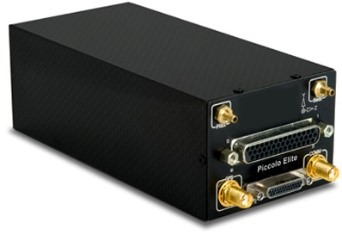
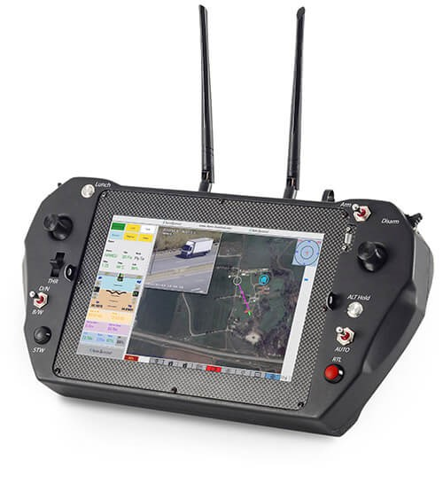
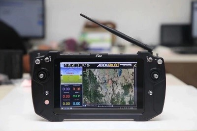
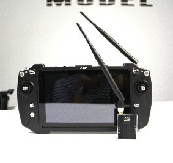
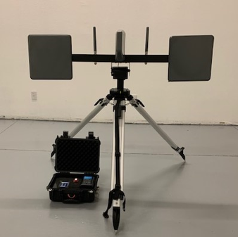
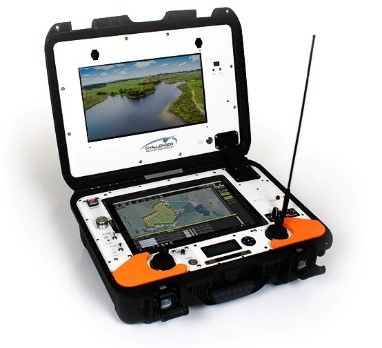
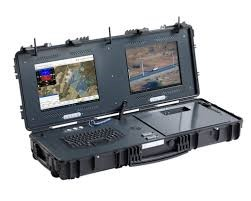
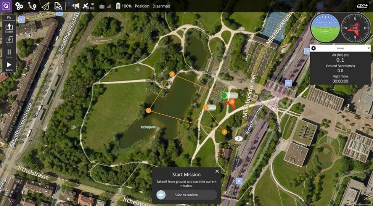

# Challenger Engineering Project

The following needs engineering and design;

•	Drone Flight control board. (VTOL, fixed wing, ground vehicle, and multi-copter) (GPS/RTK) Payload integration. 

•	Specs as follows:

|  |  |
| --- | --- |
|•	Dimensions | 5.59 x 1.81 x 2.46 inches (142.00 x 46.00 x 62.60 mm) Unflanged |
| •	Weight |7.7 oz (200 g) with 900 MHz radio |
|•	Enclosure/Mounting | EMI shielded carbon, flanged, unflanged |
| •	Operating Case Temperature | 40˚C to 80˚C (calibrated range, no case) |
| •	Power Requirements | VIN:  8 - 20 volts |
| Power: | 4 W (typical including 900 MHz radio) |
| •	RS232 Payload Interface | 5 |
| •	CAN | Simulation / General interface |
| •	Flight Termination | Deadman output |
| •	Digital/Analog I/O | 16 configurable GPIO lines. 4 GPIO lines can be configured as analog inputs, 0-5V input, 10-bit conversion |
| •	Integrated RF Data Link Options | 900 MHz unlicensed ISM. 900 MHz Australian band. 2.4 GHz unlicensed ISM. 310-390 MHz discrete. 1350-1390 MHz discrete. 1670-1700 MHz discrete. |
| •	GPS | 4 Hz uBlox module GPS receiver, 5 volts |
| •	Pressure Sensors | Ported static. 15-115 KPa-ported pitot. 4 Kpa differential. 155 kts max indicated airspeed |
| •	Waypoint Navigation | 1000 waypoints saved in autopilot |
| •	Inertial Sensors | 3 axis gyroscopes, 300°/sec. 3 axis acceleration, ±8g |
| •	Supported Peripherals | Transponders, secondary comms radios, Iridium SatComm, TASE gimbals, servo PTZ gimbals, magnetometers, laser altimeters, payload passthrough, RTK GPS. |
| •	Radio Options | 900 MHz unlicensed ISM 🔨 900 MHz Australian band 🔨  2.4 GHz unlicensed ISM 🔨 310-390 MHz discrete 🔨 1350-1390 MHz discrete 🔨 |
| •	Standard Feature Set + Peripherals | Adds new support for pan-tilt servos, improved GPS/INS performance, and more flexibility in configuring payload ports.
| •	Laser Altimeter Autoland | Provides accurate altitude information allowing the vehicle to perform a soft flared landing (Laser altimeter hardware sold separately).
| •	DGPS Autoland | Extends the autoland performance by using 2 cm accuracy DGPS. Supports autonomous taxi, rolling take-off, stationary and moving net recovery. Uses NovAtel DGPS equipment |
| •	DGPS and Moving Net Recovery | Adds support of moving net recovery needed for shipboard and other moving capture applications. Uses NovAtel DGPS equipment and associated antennas. |
| •	Helicopter Operations (VTOL) | Includes take-off and landing, precision hover, and automated path following along with autopilot assisted manual steering modes. |

•	Transmitter/receiver for drone operation. Tablet based design; windows based.

Specifications:

Challenger tablet-based GCS

Dimension: 364mm(L)*190mm(W)*40mm(H)

Weight: 1900g(T30), 3100g(T30S)

Channel: 23

Control range: 15KM (longer if possible)

Output power: Max. 25 dBm

Remote control latency: 40ms

Battery capacity: 12V/10200mAh, external battery is available

Endurance: 3H with full capacity

Display screen: 10.1-inch touch screen+800cd/sunlight readable screen

Resolution: 1920*1200

Processor: Intel i7 5th generation 5500U (or higher)

Memory: 8GB DDR3L

Storage capacity: 128GB

Operation system: Windows 10 

Three proofing’s: IP53

Network type: 4G/WIFI (optional)

Interface: USB3.0, 4G card slot, LAN, Audio, Amplifier, HDMI 

Operating temperature: -10~+60℃

V30 Transmitter

Dimension: 91mm*57mm*20mm

Weight: 120g (exclude antennas)

Frequency:  800MHZ:806-826MHZ

                    1.4GHZ:1427.9-1447.9MHZ

Wireless modulation mode: OFDM

Video input: LAN port、HDMI (optional)、CVBS

Wireless signal bandwidth: 10MHz/20MHz

Coding mode: H.265/H.264

Power supply voltage: 7.4~12V

Data output interface: UART *1/SBUS *2

HDMI interface type: Type A

Operation current: 300MA（12V power input）

Power: 0.1-1W

Antenna: 2-4dB rubber ducky antenna

Operating temperature: -10~+50℃

R20 Data Transmitter

Dimension: 53mm*40mm*14mm

Weight: 43g (exclude antennas)

Frequency: 900MHZ: 902-920MHZ (changeable)

Data output interface: TTL*1/SBUS*2

Transmission Range: 10km (or longer)

Power supply voltage: 7.4~12V

Operation current: 100MA（12V power input）

Power: 0.1-1W

Antenna: 2dB rubber ducky antenna

Operating temperature: -10~+50℃

|    |   |   | 
| --- | --- | --- |
|  |  |  |

•	Tracking antenna, video, and telemetry

telemetry decoder,
tracking antenna driver,
2-channel diversity based on video signal analysis,
3 separated video outputs,
telemetry logger on microSD card,
LCD screen with touch panel as user interface.
To be fully functional, the FPV Ground Station needs:
tracking antenna mechanism,
2 standard servos with torque about 10Ncm
switcher BEC for powering servos,
1 or 2 video receivers with antennas,
12V power source.
Ground Station is equipped with connectors:
2x video input with RCA socket (black)
2x audio input with RCA socket (red)
3x video output with RCA socket (black)
1x audio output with RCA socket (red)
power input with voltage and current measurement
power output for other devices: BEC for driving tracking antenna servos, receivers etc.
mini-USB socket for firmware actualization
microSD card for logging telemetry data
3x3 pin servo connector for tracking antenna servos (2 servos + external power input)
2x4 pin with UART for Bluetooth output and Mavlink telemetry input
2x4 pin with analogue input for antenna position tuning potentiometer
external buzzer

•	Ground control station. Windows based.
Dimensions	
1000 x 420 x 170 mm

(39.4 x 16.5 x 6.7 in)

Weight (excl. laptop)	
18.9 kg (41.7 lb)

Environmental protection	
IP66 (when closed)

Operating temperature	
-20°C to +60°C (-4°F to +140°F)

Electronics mounting base	
M4 threaded mounting grid, 45 mm pitch, aluminum mount kit included

Accessory bag internal dimensions	
220 x 160 x 70 mm

(8.7 x 6.3 x 2.8 in)

Case features	
Rugged plastic case, side handles, carry handle, wheels, pressure purge valve, shoulder strap (optional)

Electronics compartment dimensions	
320 x 270 x 80 mm

(12.6 x 10.6 x 3.2 in)

Computer mounting	
Docking

Electrical Specifications
DC input	
10 – 32 VDC, over-voltage protection, reverse polarity protection

Battery type	
Lithium ion

Battery capacity	
108 Wh

Battery operation time	
2 h (typical)

Connections (all routed to Dell Latitude 7424 Rugged Extreme)	
2 serial (RS 232), 5 USB, 2 Ethernet, 1 composite video in (IMPERX video device needed), 1 VGA in (optional), 1 microphone in, 1 audio out, PCMCIA slot, HDMI

Connections to 17” display	
Composite video (optional), external VGA input (optional)

DC power output 1	
12 V, 50 W (5 A fused)

DC power output 2	
12 V, 50 W (5 A fused)

Antenna pass-through	
Two 50 Ohm antenna pass-through to upper lid. SMA-RP termination, RG 142

Computer Specifications (not included with GCS)
Model	
Dell Latitude 7424 Rugged Extreme

Durability	
MIL-STD-810G & IP65 certified (up to 6’ drop)

Display type	
14'' Full-HD, touchscreen

Brightness	
1000 nits

17” Display Specifications
Display type	
17" TFT 1280x1024p (SXGA), optional touchscreen

Brightness	
1600 nits

Signal source	
Selectable between Dell Latitude 7424 Rugged Extreme Heavy-Duty Laptop and external VGA input (optional)

Accessories
AC/DC adapter 110 - 240 VAC to 24 VDC complete with push-pull connector

Power supply cable with push-pull connector, unterminated, 12 AWG, 5 m (16.4 ft)

GCS foldable stand

|    |   |  
| --- | --- |
|  |  |  |

•	Software windows based.

> CONFIGURE
> 
Integrated configurator allows you easily install and configure GCS 300 Autopilot specifically for your vehicle type in less than 10 minutes from the scratch. Various settings provide extremely flexible configuration to meet any requirements. (This is closed source software) This software would be based on qground station or other software.

> PLAN
> 
Creating the flight plan has never been easier - simply tap and drag & drop to place the waypoints and adjust various mission parameters. Intuitive planning interface allows you generating complex missions with no efforts.

> FLY
> 
Monitor various flight parameters of the system and adjust the plan during the mission. In case something is not right GCS will automatically notify you and suggest the available actions. Real-time video feed is integrated right in the app.

> ANALYZE
> 
All flights data is stored in GCS and can be easily accessed for mission replay and parameters analysis. Payload data acquisition can be tightly integrated with the flight data. This allows you concentrating on the mission, not the flight.

> Air Map integrated
> 
GCS has integrated services from Air Map - the world's leading airspace management platform for drones. Air Map connects drone operators with airspace authorities to enable safe, efficient, and scalable drone operations through core UTM services

> Fleet Control
> 
Unlimited number of drones supported simultaneously with super easy and intuitive control. Just as example, put a couple of drones for an autonomous survey mission while the third one is monitoring what they do.

> FEATURES
> 
Configure via USB or Telemetry
Supports 15+ types of airframes
Radio configuration
Easy IMU settings / calibration
Fast parameters tuning
On-Screen Display configuration
Camera / Gimbal settings
Various failsafe actions
Advanced parameters list access
Command line interface
Intuitive user interface
Waypoint’s mode mission interface
Region mode mission interface
Automatic mission planning
Automatic altitude calculation
Various map providers
Camera parameters support
Independent take-off and landing points
In-flight mission adjust
Waypoint’s transition customization
Win, Mac, Android, iOS, Linux
Logging 200+ parameters
Flight’s history
Log replay with powerful control
Plot window for parameters visualization
Flight plan export / import
Map’s cache for offline use
Google Earth KML export
CSV logs export

> Firmware updates
> 
- PRO Approach
GCS is not just an application for consumer tablets. Our Software is designed with deep hardware integration mindset and to be used for mission critical applications on industrial laptops and tablets.

- Live Video
GCS provides live video feed integration right in the app. You can see either full screen map, or video - you to choose. Any of the options possible with minimum latency and exceptional image quality.

- Capabilities
•	All-integrated system approach - plug and fly
•	Extremely stable flight in 
     - stabilize (user control) 
     - position hold (semi-autonomous control) 
     - auto (fully autonomous navigation and control)
•	Mavlink compatible Ground Control Station protocol
•	Accurate Position hold 
     - Horizontal: up to 40cm 
     - Vertical: up to 10cm
•	Manual altitude override
•	Fully autonomous waypoints flight
•	Autonomous take off
•	Autonomous landing
•	Return to Home mode
•	Low battery detection and Failsafe triggering
•	And many more...

Schooling pages:
<ul>




<li><a href="{{ page.url | remove: "/" }}">{{page.title}}</a></li>



</ul>

Schooling pages:

   
{{page.title}}
  


