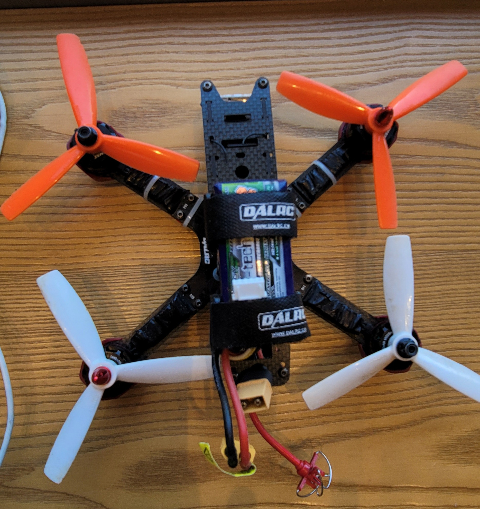

## Darlc215

| Type  | Details | Type  | Details |
| :---: | ---  | :---: | ---  |
| frame |  | FC |  |
| motor |  | ESC |  |
| RC  |  | mode |  |
| weight |  | class |  |
| battery |  | air-time |  |
| configurator |  |  last updated |   |
### highlight

```
Highlights
Angle-adjustable camera mount, with shock-absorber function
Motor protective mount, with landing gear function
Multiple antenna holes on upper board and center board, convenient to fix antenna
1.5MM 3K all carbon fiber upper layer board
3MM integrated arm and body, super tough
Smart layout, easy installation
Adopt imported YFS screw
Support Mobius 808, Runcam, SJCAM camera
DL180 is designed for FPV race, all carbon integrated fiber body, super powerful, very tough. It comes with motor protection base and adjustable camera base which can used to change angle
```

### specification

|General|  |
|:----| :--- |
|Type	| Frame Kit|
|Material	| Carbon fiber|
|Size/Weight	| Wheelbase: 180mm|
|Weight: | 80g|
|Arm thickness: | 3mm|
|Parts Recommended (Not included):	| Motor: Eachine BG1806 2300KV or Emax PM1806 2300KV motor or Emax MT2204 2300KV Motor(If use 2204 motors, we suggest 4045 props, 4S 1000MAH)|
|ESC: | 10-20A Eachine XM Series 10A ESC BLHeli or EMAX BLHeli Series 12A 20A ESC or Emax Simonk Series 12A 20A ESC or DYS BL16A Mini ESC OPTO or DYS BL20A Mini 20A BLHeli ESC OPTO|
|Flight controller: | OpenPilot CC3D Atom or EMAX Skyline32 Naze32|
|Propeller: | 4 inch HQProp Bullnose 4045 Propeller or Gemfan 4045 Bullnose Propeller or DAL 4045 Propeller|
|Battery: | 1100MAH 3S, 1500MAH 4S|
|Camera: | Mobius ActionCam 808#16 or runcam camera|
|Compatible	| Racing Quadcopter|

## FC 

> Spacing f3 6dot


## camera

> Aomway


## Controller - 💯 Stick Mode 2

> Devention
[site](https://www.manualslib.com/products/Devention-Devo-F12e-3790325.html)
[pdf](./devo_f12e.pdf)